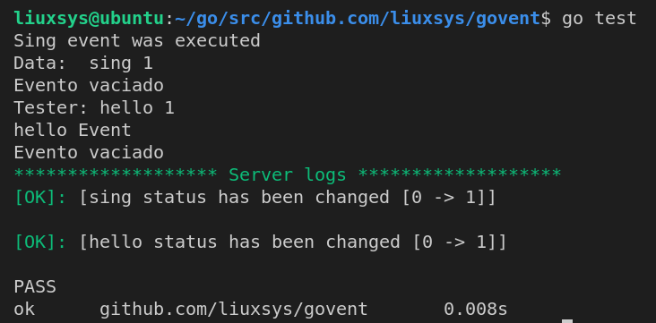

# Govent

[](https://GitHub.com/liuxsys/govent/graphs/commit-activity)   [](https://GitHub.com/liuxsys/govent/tags/) [](https://GitHub.com/liuxsys/govent/stargazers/) [](https://GitHub.com/liuxsys/govent/releases/) [](https://github.com/liuxsys/govent/blob/master/)


### What is?
Govent is a tool that will help you manipulate events and execute tasks when they are activated, easy to use and dynamic.

## Documentation

- ```Event```: You can create an Event as follows.
```go
sing := d.NewEvent("sing")
```
Note: An event by default has the value CERO.

------

- ```Event boxes```: An event box helps to have control over the events and manipulate them in a better way, the event boxes give us a more flexible and easier way to handle events than to do it manually.
``` go
govent := d.NewEventBox("Server") // Name of box = Server
```
- #### ***Methods***:
  - ```Timeout```: Add a timeout for events.
  - ```Regis```: Register a new event, pass the name and function as a parameter. **Note**: This function has a receiver type parameter which is where all the event information is.
  - ```On```: This is a function that must be executed strictly as goroutine so that the execution of the program does not pause and continue its execution, this function will detect when an event passes from one state to another and will execute the function registered in the **Regis** function of the event.
  - ```Change```: This function changes the state of an event, by default the states of the functions comes in **CERO** and must be changed to **ONE**, once the state is changed, the ***On function*** will receive it and execute the function registered in the ***Regis function***, it receives as a pointer parameter of the event and a ***context.Background()*** .
  - ```Logger```: This function delivers a console record of the event box, it is of great help to know the status and modifications of events.

**Note:** There are two states CERO and ONE the states created by the user come by default with the value CERO

-------
> Code:

``` go
package govent_test

import (
	"context"
	"fmt"
	"testing"

	d "github.com/liuxsys/govent"
)

func TestGoEvent(t *testing.T) {

	// Eventos
	evento := d.NewEvent("hello")
	sing := d.NewEvent("sing")

	// EventoBox
	govent := d.NewEventBox("Server")
	govent.TimeOut(24)

	govent.Regis(evento, func(resume d.Recive) {
		fmt.Println("Tester:", resume.Name, resume.Status)

		fmt.Println("hello Event")
	})

	govent.Regis(sing, func(resume d.Recive) {
		fmt.Println("Sing event was executed")

		fmt.Println("Data: ", resume.Name, resume.Status)
	})

	go govent.On(evento, context.Background())

	go govent.On(sing, context.Background())

	govent.Change(&sing, d.ONE)

	govent.Change(&evento, d.ONE)

	govent.Logger()

}
```

> Output:
 


------

**Mantainer:** liuxsys

------
## License
The MIT License (MIT) - see [```LICENSE.md```](https://github.com/liuxsys/Govent/blob/master/LICENSE.md) for more details
